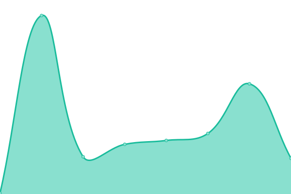

# [📈 Live Status](https://demo.upptime.js.org): <!--live status--> **🟩 All systems operational**

This repository contains the open-source uptime monitor and status page for [Armand LEOPOLD](armandleopold.fr), powered by [Upptime](https://github.com/upptime/upptime).

With [Upptime](https://upptime.js.org), you can get your own unlimited and free uptime monitor and status page, powered entirely by a GitHub repository. We use [Issues](https://github.com/armandleopold/statuspage/issues) as incident reports, [Actions](https://github.com/armandleopold/statuspage/actions) as uptime monitors, and [Pages](https://demo.upptime.js.org) for the status page.

<!--start: status pages-->
<!-- This summary is generated by Upptime (https://github.com/upptime/upptime) -->
<!-- Do not edit this manually, your changes will be overwritten -->
<!-- prettier-ignore -->
| URL | Status | History | Response Time | Uptime |
| --- | ------ | ------- | ------------- | ------ |
|  [Rancher](https://rancher.armandleopold.fr) | 🟩 Up | [rancher.yml](https://github.com/armandleopold/statuspage/commits/HEAD/history/rancher.yml) | 

 558ms
     
 | 

<a href="https://status.armandleopold.fr/history/rancher">99.56%</a>
    

|  [Grafana](https://grafana.armandleopold.fr) | 🟩 Up | [grafana.yml](https://github.com/armandleopold/statuspage/commits/HEAD/history/grafana.yml) | 

 820ms
     
 | 

<a href="https://status.armandleopold.fr/history/grafana">99.58%</a>
    

|  [Blog](https://armandleopold.fr) | 🟩 Up | [blog.yml](https://github.com/armandleopold/statuspage/commits/HEAD/history/blog.yml) | 

 471ms
     
 | 

<a href="https://status.armandleopold.fr/history/blog">99.61%</a>
    

|  [Maisondejuncarot](https://maisondejuncarot.fr) | 🟩 Up | [maisondejuncarot.yml](https://github.com/armandleopold/statuspage/commits/HEAD/history/maisondejuncarot.yml) | 

 486ms
     
 | 

<a href="https://status.armandleopold.fr/history/maisondejuncarot">99.63%</a>
    

|  [Files](https://files.armandleopold.fr) | 🟩 Up | [files.yml](https://github.com/armandleopold/statuspage/commits/HEAD/history/files.yml) | 

 418ms
     
 | 

<a href="https://status.armandleopold.fr/history/files">99.66%</a>
    

|  [Helm](https://helm.armandleopold.fr) | 🟩 Up | [helm.yml](https://github.com/armandleopold/statuspage/commits/HEAD/history/helm.yml) | 

 161ms
     
 | 

<a href="https://status.armandleopold.fr/history/helm">100.00%</a>
    

|  [Slapp](https://slapp.armandleopold.fr) | 🟩 Up | [slapp.yml](https://github.com/armandleopold/statuspage/commits/HEAD/history/slapp.yml) | 

 241ms
     
 | 

<a href="https://status.armandleopold.fr/history/slapp">100.00%</a>
    

|  [2048](https://2048.armandleopold.fr) | 🟩 Up | [2048.yml](https://github.com/armandleopold/statuspage/commits/HEAD/history/2048.yml) | 

 135ms
     
 | 

<a href="https://status.armandleopold.fr/history/2048">100.00%</a>
    

<!--end: status pages-->

## 📄 License

- Powered by: [Upptime](https://github.com/upptime/upptime)
- Code: [MIT](./LICENSE) © [Armand LEOPOLD](armandleopold.fr)
- Data in the `./history` directory: [Open Database License](https://opendatacommons.org/licenses/odbl/1-0/)
